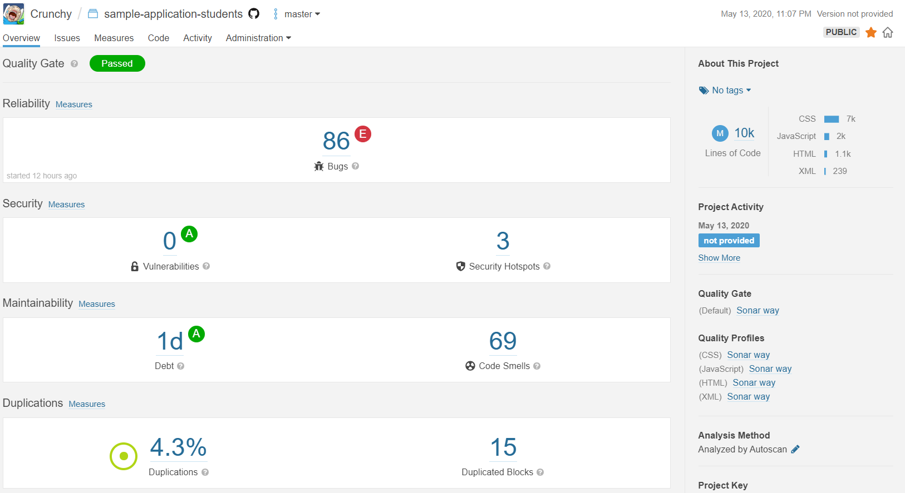

# TP part 02 - CI/CD

### how? why? TP1

For TP1 we built a simple 3-tier application runned by docker-compose
The point of this was to obtain an application that can be deployed automatically and configured easily.

## Build and test your application

### Ok, what is it supposed to do ?

```bash
mvn clean verirfy
```

this command is supposed to build and launch tests defined in the application and return whether it was successful or not.

### What are Unit tests ? Integration test ?

Unit tests are supposed to check if one functionality of an application work as expected.

Integration test checks if functionalities work between each other.

### What is a db changelog job ?

A db changelog job is meant to maintain database versioning

### What are testcontainers?

What Is testcontainers : a java library that run docker "lightweight, throwaway instances" to test common databases, 
Selenium web browsers, etc. (according to google)


### Working CI with travis file.

```yaml
# .travis.yml
language: java

script: mvn clean verify
```

### Why do we need this branch ?

This branch is needed because we don't want to continuously Deliver on every branch that is created    

### Secured variables, why ?

To protect our repository and build a parameterizable application 

### Why do we need this ?

We need Dockerfile to build our images  

### For what purpose ?

???

### Working quality gate.




